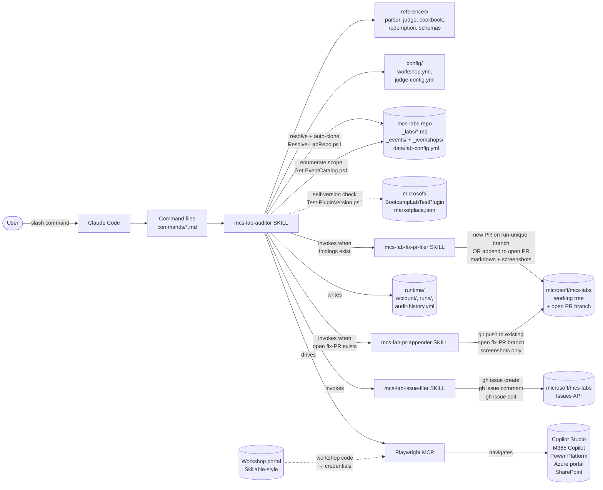
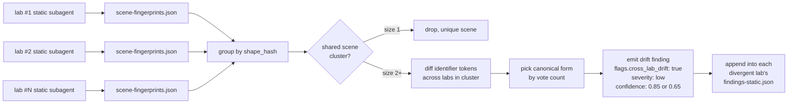
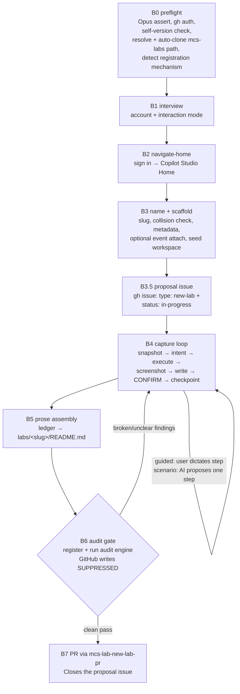
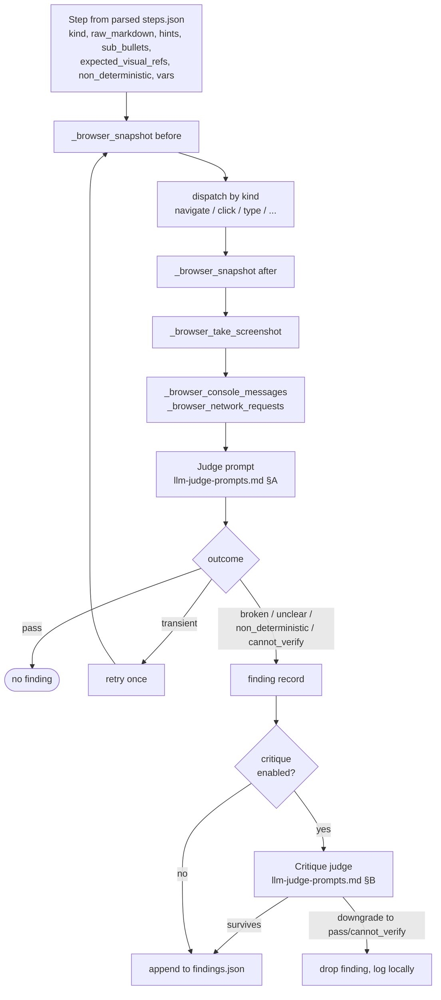
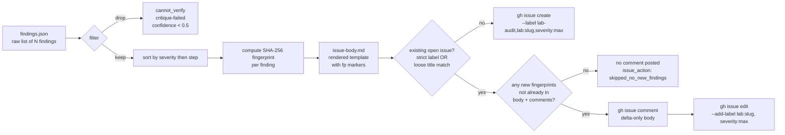

# Architecture

This document describes how `mcs-lab-auditor` is structured at runtime and how data flows — in **audit mode** from a lab's markdown to a filed GitHub issue, and in **build mode** from an interactive authoring session to a new-lab PR.

## At a glance

`mcs-lab-auditor` is a Claude Code plugin. It has no compiled code and no test runner — Claude is the runtime, and the plugin is a structured tree of markdown (commands, skills, references) plus YAML configuration. The plugin orchestrates three external systems: the user's filesystem (reading — and, in build mode, writing — the cloned `mcs-labs` repo), the Playwright MCP (driving a real browser against Microsoft product portals), and the GitHub Issues + PRs APIs. The specific repo and training portal targeted are drawn from the **active lab instance** (`mcs-labs` by default); see [Resolver layer](#resolver-layer) for how the active instance is selected.

It has **two modes**, both event/workshop-agnostic (neither is limited to the bootcamp event):

- **Audit mode** (`/audit-event`, `/audit-bootcamp`, `/audit-lab`) — drive Playwright through an existing lab's steps, judge live UI vs. written instructions, and file per-lab issues + fix PRs.
- **Build mode** (`/build-lab`, since v0.4.0) — interactively *author a new lab* end-to-end: get a workshop account, drive to the Copilot Studio Home page, capture the lab step-by-step (instructions + tips + screenshots, confirming every step), assemble a sibling-formatted `labs/<slug>/README.md`, re-run it through the **same audit engine** as a quality gate, and open a PR adding the lab to `microsoft/mcs-labs`. See [Build mode](#build-mode-interactive-lab-authoring) below.

## Components



The `microsoft/mcs-labs` nodes above reflect the default active instance; the actual repo and portal targets are resolved at run start from the active lab instance (see [Resolver layer](#resolver-layer) below).

### Resolver layer

`scripts/Resolve-LabInstance.ps1` is the **single source of truth** for which lab repo, training portal, and branch prefix the plugin operates on. At run start it merges the plugin-shipped `config/lab-instances.yml` (the built-in `mcs-labs` instance) with a user-owned `%USERPROFILE%\.mcs-lab-auditor\lab-instances.yml` (user values win per field), selects the active instance (via `--instance` flag → `$env:LAB_INSTANCE` → merged `default_instance` → shipped default), and emits the resolved instance as JSON.

Every downstream component reads from this resolver rather than from hardcoded literals:

- **`Resolve-LabRepo.ps1`** sources the clone URL, candidate paths, and managed-clone directory from the resolver, so each instance gets its own isolated working tree under `%USERPROFILE%\.mcs-lab-auditor\<instance-name>`.
- **`judge-config.yml`** branch patterns use `{branch_prefix}` and the `issues.repo` value is sourced from the active instance at run start.
- **Skills and commands** receive `{repo}` and `{branch_prefix}` from the orchestrator, which resolves them once at run start and substitutes them into every `gh` command.
- **`runtime/account/active-portal.yml`** is materialized at run start from the active instance's resolved portal object. All redemption flows read this file instead of `config/workshop.yml` directly. For the default `mcs-labs` instance the materialized file is a copy of `config/workshop.yml`, so behavior is byte-for-byte unchanged.

### Playwright MCP and host-specific tool names

Both audit mode and build mode drive the browser through a **Playwright MCP**, but the tool names exposed by that MCP are **host-specific**: Claude Code uses `playwright@claude-plugins-official` (tool names prefixed `mcp__plugin_playwright_playwright__<action>`), while Copilot CLI uses a plugin-bundled server declared in `.github/mcp.json` (`npx -y @playwright/mcp@latest --isolated`) whose tool names are the bare `<action>` names from the same `@playwright/mcp` package. The canonical mapping lives in `skills/mcs-lab-auditor/references/host-tools.md`; the cookbook references bare action names and `host-tools.md` is the single place to update for a new host or a different server. At interactive-phase start, a **preflight check** probes whether a browser MCP is available: if none is found, audit mode falls back to `--static-only` (skipping the browser phase) and build mode halts, since build requires live browser interaction.

### Key boundaries

- **Source-of-truth boundary**: the **scope catalog** (events *and* workshops) comes from two Jekyll collections in the mcs-labs repo — `_events/<id>.md` (formal curated events) and `_workshops/<id>.md` (on-demand workshops) — enumerated by `scripts/Get-EventCatalog.ps1`. Both collections share one front-matter schema (`title`, `description`, `event_id`, `order`, and a `labs:` list of `{ slug, label }`); the catalog tags each scope with `type` (event|workshop), `id`, `order`, `external`/`external_url`/`repository`, and `auditable`. `external: true` scopes (the Agent Academy tracks) host their labs in another repo (`microsoft/agent-academy`), so they are listed but `auditable: false` and never driven. The **all-labs catalog** for the single-lab picker still comes from `_data/lab-config.yml.lab_metadata.<id>` (unchanged). The legacy `_data/lab-config.yml.event_configs` table is only a last-resort fallback — it has drifted out of sync with the collections (missing agent-in-a-day + the academy workshops, still listing an obsolete mcs-in-a-day-v2). The run's scope is one of: (a) all labs in a chosen event/workshop, (b) a CSV subset of a scope's labs, or (c) a single lab from the all-labs catalog. The slug list is never hard-coded in this plugin.
- **Write boundary**:
  - *Audit mode* (three narrow paths):
    1. **Issues API** — `gh issue create | comment | edit`. Always on. Comments on existing open issues with finding-fingerprint dedup; never creates a duplicate open issue for the same lab.
    2. **Fix-PR per run** — applies the run's `suggested_correction` diffs + screenshot replacements. If an **open** fix-PR for the lab exists (same-author, mergeable), the commit is **appended** to it; otherwise `gh pr create` opens a **new** PR on a run-unique branch `{branch_prefix}/fix-<slug>-content-audit-<run-id>`. Dedup is OPEN-PR-scoped — a merged/closed prior PR never blocks a new one. Enforced in `mcs-lab-fix-pr-filer` (ADR-015).
    3. **Open PR screenshot append** — `git push` of one screenshots-only commit onto an already-open fix-PR branch. **On by default**, suppress with `--no-update-screenshots`. Same-author, mergeable, unprotected-branch guardrails enforced in `mcs-lab-pr-appender`. Never creates a new branch or new PR.
  - *Build mode* (two paths): (1) **New-lab proposal issue** — at B3.5, `gh issue create` on `microsoft/mcs-labs` (the active instance's repo; `microsoft/mcs-labs` by default) labeled `type: new-lab` + `status: in-progress`, opened as soon as the lab is named so it's tracked as **In Progress** for the whole build (deduped per slug, reused on `--resume`, closed by the lab PR). (2) **New-lab PR** — adds `labs/<slug>/README.md` + screenshots + the registration entry (`_data/lab-config.yml`, and `_labs/<slug>.md`) in one commit on a run-unique branch `{branch_prefix}/new-lab-<slug>-<build-id>` off fresh `origin/main`, via `mcs-lab-new-lab-pr`, linking the proposal issue with `Closes #<n>` (ADR-018). The build's **audit gate runs the audit engine with all GitHub writes suppressed** — it never files an issue or fix-PR; findings feed back into the build loop (ADR-017).
- **Secret boundary**: workshop credentials live only in `runtime/account/credential.enc` (DPAPI-encrypted) and in memory for the duration of one sign-in dispatch. Build mode reuses this same account flow unchanged. See [`security.md`](security.md).

## Run lifecycle

The full lifecycle of one event audit invocation (`/audit-bootcamp`, `/audit-event`, or `/audit-lab` with a single slug), end-to-end. Phase numbers correspond to `skills/mcs-lab-auditor/SKILL.md`:

```mermaid
sequenceDiagram
    autonumber
    actor User
    participant CC as Claude Code
    participant Skill as mcs-lab-auditor
    participant Cfg as configs
    participant Labs as mcs-labs repo
    participant Acct as runtime/account/
    participant Workshop as Workshop portal
    participant PW as Playwright MCP
    participant Portals as MS portals (Copilot Studio, M365, ...)
    participant Filer as mcs-lab-issue-filer
    participant PRFiler as mcs-lab-fix-pr-filer
    participant PRAppender as mcs-lab-pr-appender
    participant MCSRepo as mcs-labs working tree
    participant GH as GitHub Issues / PRs

    User->>CC: /audit-event (or /audit-bootcamp / /audit-lab)
    CC->>Skill: load skill + command
    Note over Skill: Phase 1 step 1 — Test-PluginVersion.ps1<br/>(non-blocking; warns if a newer version is published)
    Skill->>Cfg: read workshop.yml, judge-config.yml
    Skill->>Labs: Resolve-LabRepo.ps1 (env → candidates → built-ins → auto-clone; ff to origin/main)
    Skill->>Labs: Get-EventCatalog.ps1 (enumerate _events/ + _workshops/) + read lab_metadata
    Skill->>User: interview (Q1 account / Q2 phase mix / Q3 scope / Q3a event-or-workshop / Q4 lab)
    User-->>Skill: answers
    Skill->>GH: gh auth status; gh repo view (permission check)
    Skill->>Acct: read account.meta.json (if cached)
    alt cached account
        Skill->>User: "Use cached account <user_id>?"
        User-->>Skill: yes
    else no cache or "redeem new"
        Skill->>User: prompt for workshop code
        User-->>Skill: <code>
        Skill->>Workshop: navigate, fill code, submit
        Workshop-->>Skill: issued {username, password, tenant, expires}
        Skill->>Acct: encrypt via DPAPI → credential.enc + account.meta.json
    end
    Skill->>Acct: decrypt credential briefly
    Skill->>PW: sign in to login.microsoftonline.com
    PW->>Portals: AAD SSO cascade
    Skill->>PW: keep signed-in MCP browser session active

    loop per lab slug
        Skill->>Labs: read _labs/<slug>.md
        Skill->>Skill: parse → steps.json (per lab-parser-spec.md)
        loop per scene
            Skill->>PW: probe auth_probe_url
            opt session expired
                Skill->>User: "auth expired, run /audit-account redeem and resume"
                Note over Skill: halt this lab; mark error
            end
            loop per executable step
                Skill->>PW: _browser_snapshot (before)
                Skill->>PW: dispatch step (click/type/...)
                Skill->>PW: _browser_snapshot (after) + _browser_take_screenshot
                Skill->>CC: invoke judge prompt
                CC-->>Skill: outcome + confidence + suggested_correction
                opt critique enabled
                    Skill->>CC: critique prompt
                    CC-->>Skill: survives? (downgrade if not)
                end
                Skill->>Skill: append to findings.json (if non-pass)
            end
            Skill->>Skill: checkpoint.yml ← scene complete
        end
        alt findings exist (above threshold)
            Skill->>Filer: invoke with findings.json + existing-state.yml
            Note over Filer: existing_state probed in Phase 1.4<br/>(strict + loose query union)
            alt existing open issue
                Filer->>Filer: fingerprint-dedup findings vs.<br/>existing body + comments
                alt all findings already covered
                    Filer->>Skill: issue_action: skipped_no_new_findings
                else new findings remain
                    Filer->>GH: gh issue comment (delta only)
                    Filer->>GH: gh issue edit --add-label lab:slug (backfill)
                end
            else no open issue
                Filer->>GH: gh issue create<br/>(lab-audit + lab:slug + severity:max)
            end
            GH-->>Filer: issue/comment URL
            Skill->>PRFiler: invoke with issue# + findings.json + existing-state.yml
            Note over PRFiler: PR dedup is OPEN-PR-scoped<br/>(merged/closed PRs don't block)
            alt open fix-PR exists for slug (same-author, mergeable)
                PRFiler->>MCSRepo: gh pr checkout + apply diffs + commit + push (append)
                PRFiler->>GH: gh pr comment (appended fixes)
            else no open PR
                PRFiler->>MCSRepo: new branch {branch_prefix}/fix-slug-content-audit-run_id + commit + push
                PRFiler->>GH: gh pr create (Closes #issue)
            end
        else clean pass
            Skill->>Skill: append to clean-labs.yml (no GitHub call)
        end
        opt --no-update-screenshots NOT passed AND open fix-PR exists AND screenshots refreshed
            Skill->>PRAppender: invoke with existing_pr + screenshots/
            PRAppender->>PRAppender: guardrails (same-author,<br/>mergeable, unprotected branch)
            PRAppender->>MCSRepo: gh pr checkout + replace images + git commit + git push
            PRAppender->>GH: gh pr comment (summary)
        end
        Skill->>Acct: append to audit-history.yml
    end
    Skill->>PW: browser_close
    Skill->>User: summary (counts, run-id, issue URLs)
```

## Cross-lab consistency fan-in (Phase 1.7 step 1a)

After every per-lab static subagent has emitted its `findings-static.json` and `scene-fingerprints.json`, the orchestrator runs a single fan-in pass that groups scenes by shape hash and diffs identifier tokens across sibling labs. This catches the case where two labs verify the same UI surface but have drifted in surface wording — e.g. one says `Address 1: State/Province` and another says `Address1: State or Providence`.



For single-lab runs, the fan-in reads the most recent prior-run `scene-fingerprints.json` for every other lab in `lab_metadata.*.id` (full all-labs catalog). Labs that have never been audited contribute nothing — the issue body explicitly documents the discovery limit. Full algorithm in `skills/mcs-lab-auditor/references/cross-lab-consistency.md`.

## Build mode (interactive lab authoring)

Build mode (`/build-lab` → `mcs-lab-builder` skill, v0.4.0+) authors a brand-new lab and ships it as a PR. It reuses audit mode's account flow, Playwright cookbook, LLM judge, and finding schema, and adds an interactive authoring loop on top. It is **event/workshop-agnostic**: a lab is built and tested standalone; attaching it to an event or workshop is an optional B3 choice, with the available scopes read dynamically from the `_events/` + `_workshops/` collections (`scripts/Get-EventCatalog.ps1`).

The lifecycle runs in phases B0–B7 (see `skills/mcs-lab-builder/SKILL.md`):



**Two interaction modes**, both confirming **every** step before checkpoint:
- **guided** — the user dictates each step and any key consideration; the AI executes it, captures a screenshot, and writes the instruction prose.
- **scenario** — the user gives the scenario up front; the AI proposes one step at a time and executes it only after confirmation.

**A "new lab proposal" issue is opened up front (B3.5).** As soon as the lab is named, build mode files a `type: new-lab` + `status: in-progress` issue on `microsoft/mcs-labs` so the lab is visible to the team as *In Progress* for the whole build. It is deduped per slug, reused on `--resume`, recorded in `manifest.proposal_issue`, and closed by the B7 PR. This is governed by `build.proposal_issue` and is one of build mode's **two** intentional GitHub writes (the other is the B7 PR).

**The audit gate (B6) reuses the audit engine, diverting disposition.** It stages + registers the built lab, materializes `_labs/<slug>.md`, then runs the auditor's per-UC judge loop against it — but consumes findings *in-loop* (each above-threshold `broken`/`unclear` finding loops back to B4 for a fix) instead of routing them to `mcs-lab-issue-filer`. `build.audit_gate.suppress_github_writes` guarantees no issue/PR is filed *by the gate* — the proposal issue and the new-lab PR are the only GitHub writes build mode makes.

**The mcs-labs repo path is resolved (and auto-cloned) at B0** by the shared `scripts/Resolve-LabRepo.ps1` — the same resolver audit mode uses — trying `$env:MCS_LABS_REPO`, the `mcs_labs_repo_path_candidates` config list, built-in candidates under `%USERPROFILE%`, and finally cloning `microsoft/mcs-labs` into `%USERPROFILE%\.mcs-lab-auditor\mcs-labs` (the managed clone is per-instance — `%USERPROFILE%\.mcs-lab-auditor\<instance-name>`; the default `mcs-labs` instance keeps `…\mcs-labs`); the resolved repo is fast-forwarded to `origin/main`. See ADR-023.

**Registration mechanism is detected at runtime** (B0). The new-lab toolchain documented in `mcs-labs/docs/NEW_LAB_CHECKLIST.md` (root `lab-config.yml` + `Generate-Labs.ps1`) is currently absent from that repo, so build mode falls back to **direct writes** of `labs/<slug>/README.md` + `_labs/<slug>.md` + the `_data/lab-config.yml` entry. If a generator returns, it edits the root config and runs it instead. See `skills/mcs-lab-builder/references/lab-registration-spec.md` and ADR-020.

## Per-step data flow

What happens inside one step of one scene of one lab:



## Finding → issue mapping

Each lab's `findings.json` is rendered into exactly one issue body (or one comment on an existing issue). Findings are grouped by severity (high → medium → low) and ordered by step within severity. Findings tagged `cannot_verify` or with `flags.critique_pass_survived: false` are filtered out before rendering. Findings with confidence 0.5–0.7 are included but visually marked `(low confidence — please verify)`.



## Files written per run

```
runtime/
├── account/                                    # written once at run start
│   ├── credential.enc                          # DPAPI blob; user-scoped
│   ├── account.meta.json                       # cleartext metadata only
├── audit-history.yml                           # appended once per lab per run
└── runs/<run-id>/
    ├── manifest.yml                            # written/updated continuously
    ├── checkpoint.yml                          # written per scene boundary
    ├── clean-labs.yml                          # appended for clean labs
    └── labs/<slug>/
        ├── steps.json                          # written once at parse time
        ├── findings.json                       # appended per finding
        ├── transcript.md                       # human-readable log
        ├── issue-body.md                       # rendered if findings file an issue
        ├── screenshots/<step-id>.png           # per step
        └── snapshots/<step-id>.yml             # per step
```

Build mode writes its own workspace alongside `runs/` (gitignored, never committed):

```
runtime/builds/<build-id>/
├── manifest.yml          # slug, mode, account, metadata, events, registration_mode, phase cursor
├── session-state.yml     # resume cursor (current uc/scene, last confirmed step, browser_left_at)
├── ledger.yml            # ordered confirmed step records — source of truth for B5
├── draft/
│   ├── README.md         # assembled lab (promoted to labs/<slug>/README.md at B6/B7)
│   └── images/*.png      # captured screenshots (promoted to labs/<slug>/images/)
├── snapshots/*.yml       # before/after a11y trees (context-saver, never shipped)
├── audit/findings.json   # B6 gate findings, consumed in-loop (NOT routed to issue-filer)
└── pr-body.md, pr-url.txt
```

All of `runtime/` is gitignored and never leaves the local machine. In build mode the mcs-labs working tree is touched only at B6/B7.

## Why this shape

A few choices that aren't obvious from the file list:

- **Structured step parsing**, rather than feeding raw markdown to the judge each step. This keeps step IDs stable across runs (so re-audits can de-duplicate and the user can refer to "step usecase-2.scene-3.step-4" reliably) and bounds per-step cost.
- **Scenes as the resumable boundary**, not individual steps. Clicks aren't idempotent; navigation is. If a run dies, we restart at the last completed scene — losing at most one scene's progress.
- **Issues first, then narrow PR paths.** Audit findings are described in an issue body (the maintainer applies what they agree with); a fix-PR per run then ships the concrete edits, and build mode opens a new-lab PR. The plugin deliberately keeps every write path narrow and explicit (ADR-001, ADR-014, ADR-015, ADR-018) rather than auto-mutating the repo freely — issues remain the always-on, lowest-stakes channel.
- **Single SSO state across portals**, captured once after sign-in. AAD federation means cookies set by `login.microsoftonline.com` flow to all five target portals; no per-portal manual login.
- **DPAPI for credential storage**, not a config file or a keyring abstraction. DPAPI is Windows-native, user-scoped, requires no third-party dependency, and survives reboot without any startup unlocking step. The trade-off: not portable to macOS/Linux (see [`security.md`](security.md) for the full reasoning).

For the full enumeration of architectural decisions and their rationales, see [`design-decisions.md`](design-decisions.md).
