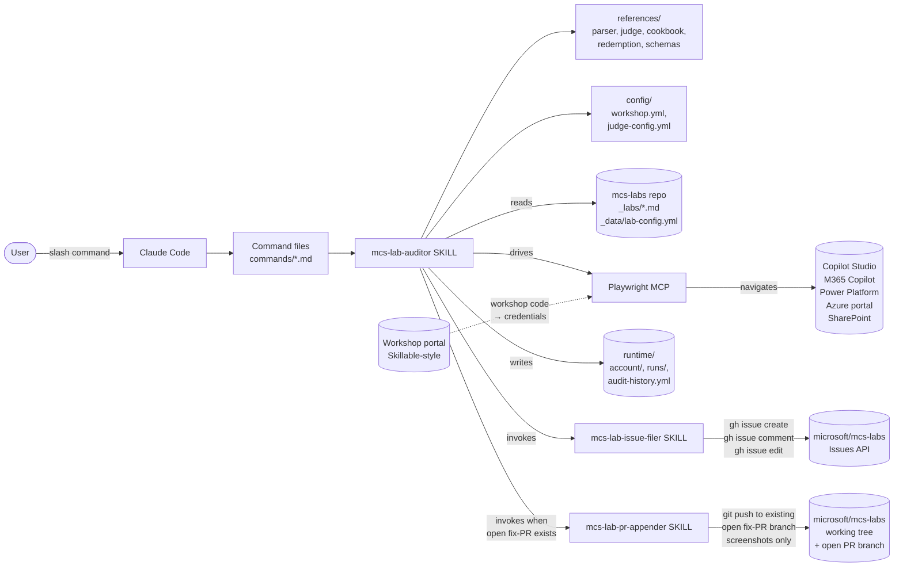
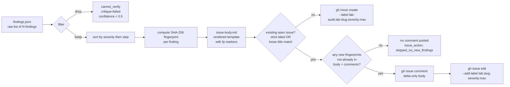

# Architecture

This document describes how `mcs-lab-auditor` is structured at runtime and how data flows from a lab's markdown to a filed GitHub issue.

## At a glance

`mcs-lab-auditor` is a Claude Code plugin. It has no compiled code and no test runner — Claude is the runtime, and the plugin is a structured tree of markdown (commands, skills, references) plus YAML configuration. The plugin orchestrates three external systems: the user's filesystem (reading the cloned `mcs-labs` repo), the Playwright MCP (driving a real browser against Microsoft product portals), and the GitHub Issues API (filing per-lab findings).

## Components



### Key boundaries

- **Source-of-truth boundary**: `_data/lab-config.yml` → `lab_orders.event.bootcamp` enumerates labs at runtime. The slug list is never hard-coded in this plugin.
- **Write boundary** (two narrow paths only):
  1. **Issues API** — `gh issue create | comment | edit`. Always on. Comments on existing open issues with finding-fingerprint dedup; never creates a duplicate open issue for the same lab.
  2. **Open PR append** — `git push` of one screenshots-only commit onto an already-open fix-PR branch. **On by default**, suppress with `--no-update-screenshots`. Same-author, mergeable, unprotected-branch guardrails enforced in `mcs-lab-pr-appender`. Never creates a new branch or new PR.
- **Secret boundary**: workshop credentials live only in `runtime/account/credential.enc` (DPAPI-encrypted) and in memory for the duration of one sign-in dispatch. See [`security.md`](security.md).

## Run lifecycle

The full lifecycle of one `/audit-bootcamp` invocation, end-to-end:

```mermaid
sequenceDiagram
    autonumber
    actor User
    participant CC as Claude Code
    participant Skill as mcs-lab-auditor
    participant Cfg as configs
    participant Labs as mcs-labs repo
    participant Acct as runtime/account/
    participant Workshop as Workshop portal
    participant PW as Playwright MCP
    participant Portals as MS portals (Copilot Studio, M365, ...)
    participant Filer as mcs-lab-issue-filer
    participant PRAppender as mcs-lab-pr-appender
    participant MCSRepo as mcs-labs working tree
    participant GH as GitHub Issues / PRs

    User->>CC: /audit-bootcamp
    CC->>Skill: load skill + command
    Skill->>Cfg: read workshop.yml, judge-config.yml
    Skill->>Labs: read lab-config.yml → bootcamp slugs
    Skill->>GH: gh auth status; gh repo view (permission check)
    Skill->>Acct: read account.meta.json (if cached)
    alt cached account
        Skill->>User: "Use cached account <user_id>?"
        User-->>Skill: yes
    else no cache or "redeem new"
        Skill->>User: prompt for workshop code
        User-->>Skill: <code>
        Skill->>Workshop: navigate, fill code, submit
        Workshop-->>Skill: issued {username, password, tenant, expires}
        Skill->>Acct: encrypt via DPAPI → credential.enc + account.meta.json
    end
    Skill->>Acct: decrypt credential briefly
    Skill->>PW: sign in to login.microsoftonline.com
    PW->>Portals: AAD SSO cascade
    Skill->>PW: keep signed-in MCP browser session active

    loop per lab slug
        Skill->>Labs: read _labs/<slug>.md
        Skill->>Skill: parse → steps.json (per lab-parser-spec.md)
        loop per scene
            Skill->>PW: probe auth_probe_url
            opt session expired
                Skill->>User: "auth expired, run /audit-account redeem and resume"
                Note over Skill: halt this lab; mark error
            end
            loop per executable step
                Skill->>PW: _browser_snapshot (before)
                Skill->>PW: dispatch step (click/type/...)
                Skill->>PW: _browser_snapshot (after) + _browser_take_screenshot
                Skill->>CC: invoke judge prompt
                CC-->>Skill: outcome + confidence + suggested_correction
                opt critique enabled
                    Skill->>CC: critique prompt
                    CC-->>Skill: survives? (downgrade if not)
                end
                Skill->>Skill: append to findings.json (if non-pass)
            end
            Skill->>Skill: checkpoint.yml ← scene complete
        end
        alt findings exist (above threshold)
            Skill->>Filer: invoke with findings.json + existing-state.yml
            Note over Filer: existing_state probed in Phase 1.4<br/>(strict + loose query union)
            alt existing open issue
                Filer->>Filer: fingerprint-dedup findings vs.<br/>existing body + comments
                alt all findings already covered
                    Filer->>Skill: issue_action: skipped_no_new_findings
                else new findings remain
                    Filer->>GH: gh issue comment (delta only)
                    Filer->>GH: gh issue edit --add-label lab:slug (backfill)
                end
            else no open issue
                Filer->>GH: gh issue create<br/>(lab-audit + lab:slug + severity:max)
            end
            GH-->>Filer: issue/comment URL
        else clean pass
            Skill->>Skill: append to clean-labs.yml (no GitHub call)
        end
        opt --no-update-screenshots NOT passed AND open fix-PR exists AND screenshots refreshed
            Skill->>PRAppender: invoke with existing_pr + screenshots/
            PRAppender->>PRAppender: guardrails (same-author,<br/>mergeable, unprotected branch)
            PRAppender->>MCSRepo: gh pr checkout + replace images + git commit + git push
            PRAppender->>GH: gh pr comment (summary)
        end
        Skill->>Acct: append to audit-history.yml
    end
    Skill->>PW: browser_close
    Skill->>User: summary (counts, run-id, issue URLs)
```

## Per-step data flow

What happens inside one step of one scene of one lab:


## Finding → issue mapping

Each lab's `findings.json` is rendered into exactly one issue body (or one comment on an existing issue). Findings are grouped by severity (high → medium → low) and ordered by step within severity. Findings tagged `cannot_verify` or with `flags.critique_pass_survived: false` are filtered out before rendering. Findings with confidence 0.5–0.7 are included but visually marked `(low confidence — please verify)`.



## Files written per run

```
runtime/
├── account/                                    # written once at run start
│   ├── credential.enc                          # DPAPI blob; user-scoped
│   ├── account.meta.json                       # cleartext metadata only
├── audit-history.yml                           # appended once per lab per run
└── runs/<run-id>/
    ├── manifest.yml                            # written/updated continuously
    ├── checkpoint.yml                          # written per scene boundary
    ├── clean-labs.yml                          # appended for clean labs
    └── labs/<slug>/
        ├── steps.json                          # written once at parse time
        ├── findings.json                       # appended per finding
        ├── transcript.md                       # human-readable log
        ├── issue-body.md                       # rendered if findings file an issue
        ├── screenshots/<step-id>.png           # per step
        └── snapshots/<step-id>.yml             # per step
```

All of `runtime/` is gitignored and never leaves the local machine.

## Why this shape

A few choices that aren't obvious from the file list:

- **Structured step parsing**, rather than feeding raw markdown to the judge each step. This keeps step IDs stable across runs (so re-audits can de-duplicate and the user can refer to "step usecase-2.scene-3.step-4" reliably) and bounds per-step cost.
- **Scenes as the resumable boundary**, not individual steps. Clicks aren't idempotent; navigation is. If a run dies, we restart at the last completed scene — losing at most one scene's progress.
- **Issues, not PRs.** The plugin describes corrections in the issue body; the maintainer applies what they agree with. This avoids CODEOWNERS / branch-protection / signed-commits concerns and keeps the plugin's relationship to `microsoft/mcs-labs` strictly read+issue.
- **Single SSO state across portals**, captured once after sign-in. AAD federation means cookies set by `login.microsoftonline.com` flow to all five target portals; no per-portal manual login.
- **DPAPI for credential storage**, not a config file or a keyring abstraction. DPAPI is Windows-native, user-scoped, requires no third-party dependency, and survives reboot without any startup unlocking step. The trade-off: not portable to macOS/Linux (see [`security.md`](security.md) for the full reasoning).

For the full enumeration of architectural decisions and their rationales, see [`design-decisions.md`](design-decisions.md).
